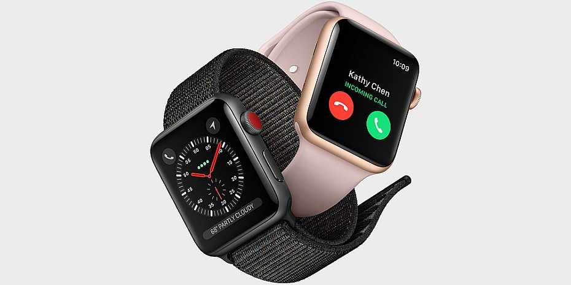

Apple Watch Series 3 - Relevant Technical Specifications
--------

{: .img}

-  GPS
-  4G
-  Wifi
-  Bluetooth (4.2)
-  Hoogtemeter
-  Display: 272x340px (38mm) - 312x390px (42mm)
-  Touchscreen + Force Touch
-  Double tap Screen = Tekst wordt luidop voorgelezen
-  Swipen
-  The Digital Crown:
   -  Eén druk = Terug naar home
   -  Double click = Terug
   -  Ingedrukt houden = Activeert Siri
-  Side / Power button
   - Double tap: Apple Pay

### Nuttigheden: 
-  **GPS + Hoogtemeter:** Interactieve plattegrond die verschillende verdiepen onderscheidt
-  **Bluetooth:** Audiogids met draadloze hoofdtelefoon
-  **Wifi:** Verbinden met Bozar wifi om al de informatie te downloaden
-  **Double tap Screen:** Leest geschreven gids voor (indien bv: te lang)
-  **Double tap Power Button:** Apple Pay (tickets bestellen aan zelfkassa)

Apple IPHONE 6S  - Relevant Technical Specifications
--------

{: .imgtall}

-  GPS (+GLONASS, Galileo en QZSS)
-  4G
-  Wifi
-  Bluetooth (4.2)
-  Barometer
-  Display: 1334 x 750 pixels bij 326 ppi
-  4,7-inch (diagonaal) LCD-breedbeeld­display met Multi-Touch en IPS-technologie
-  Touch ID
-  12 – MP camera

### Nuttigheden:

-  **GPS en Barometer**: Interactieve plattegrond die verschillende verdiepen onderscheidt
-  **Camera**: QR codes kunnen gescand en gebruikt worden voor de audiogids
-  **Wifi & 4G**: gebruik van internet om al de informatie te downloaden. Er kan gebruik gemaakt worden van de wifi in het Bozar.

Correctie
--------

Achteraf gezien besloten we toch niet al de functies die we hier bedachten in de applicatie toe te voegen, na enkele malen gesproken te hebben met de docenten hadden we door dat **Less is more** hier van toepassing was.