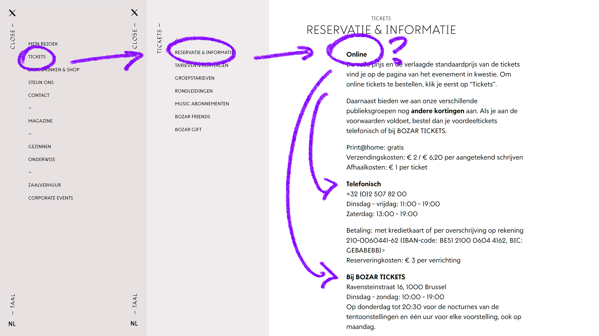
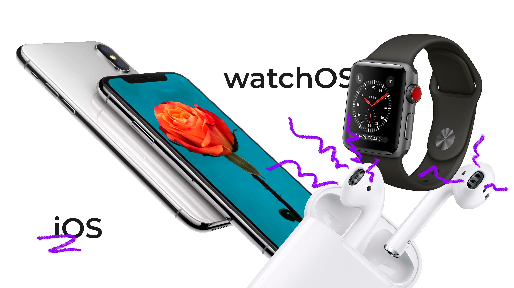

We ontwerpen een app die zich naadloos integreert in de museum ervaring, hier een aanzienlijke meerwaarde aan biedt en tegelijk ook enkele van de functionaliteiten van de huidige Bozar website opneemt om een all-round experience te creëren.

Zie hieronder een voorbeeld van de absoluut niet geoptimaliseerde UI / UX van de huidige website.

{: .img}

### Functies zijn:
-  Tickets bestellen*
-  Interactieve openingsuren
-  Audio en tekstuele gidsen*
-  Interactieve plattegrond
-  Overzicht lopende tentoonstellingen
-  Elektronisch ticket  
*Gelimiteerd tot de iOS versie.

{: .img}

De app wordt initieel gelanceerd op iOS en WatchOS. Later zal deze overgebracht worden naar Android.
