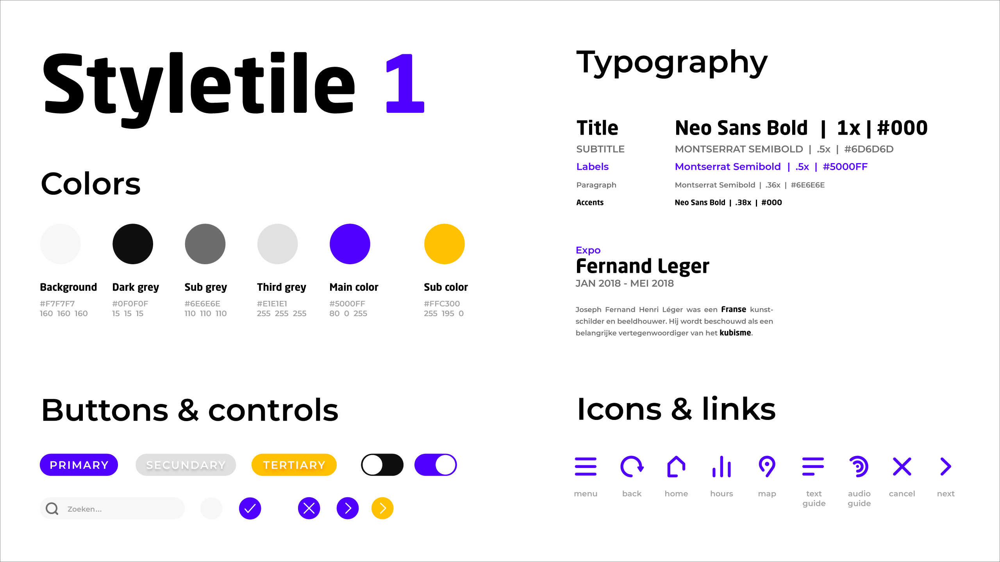
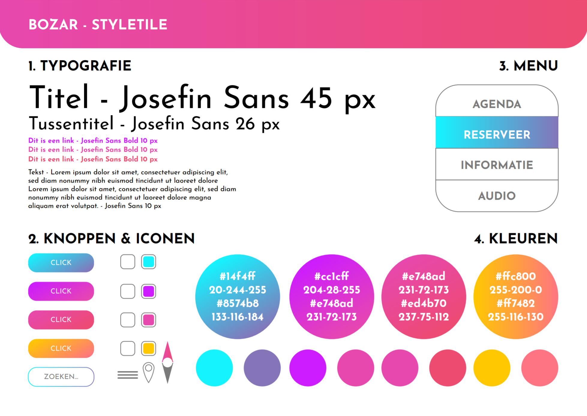
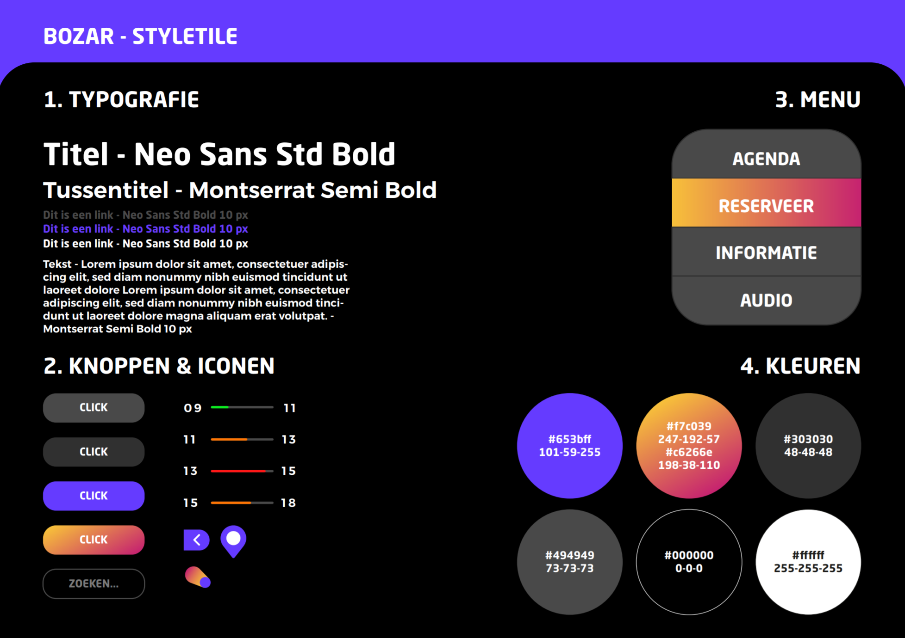

Alvorens de styletiles op te stellen zochten we **design guidelines** op voor zowel iOS als WatchOS systemen. Zo kwamen we erachter dat de WatchOS guidelines verplichten een donkere tot zwarte achtergrond te hanteren. Met dit in ons achterhoofd begonnen we na te denken. We creëerden elk 1 styletile en legden deze dan naast elkaar. Zo kwamen we tot een derde styletile die onze beiden visies volgde.

Alternatief 1
-------------

{: .img}

Lukas ontwierp de eerste styletile. Wat we hier vooral van wegnamen was het felle paars, maar ook het contrast tussen Artevelde's **Neo Sans** en **Montserrat**.

Alternatief 2
-------------

{: .img}

Wolf koos vooral voor zeer felle gradiënten. We besloten dat dit een een goede keuze was, gecombineerd met het paars zouden we op deze manier de anders zeer donkere lay-out kunnen opfleuren. 

Finale
-------

{: .img}

We brachten al de voorafgaand genoemde elementen samen in één styletile en combineerden deze met enkele varianten van donker grijs.